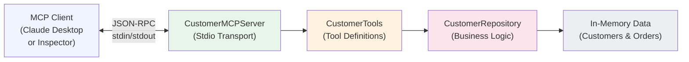

# CustomerMCPServer

**A .NET MCP server that exposes customer data and order history as AI-ready tools.**

---

## Overview

CustomerMCPServer is a **Model Context Protocol (MCP) server** built with C# and .NET 10. The Model Context Protocol is a standard that lets AI assistants (like Claude) connect to your internal tools and data via a simple, language-agnostic interface.

This project demonstrates how to:
- Build a production-ready MCP server using .NET's dependency injection and async patterns
- Design tools with clear, schema-free descriptions that guide AI behavior
- Connect the server to Claude or other MCP clients via stdio transport

The server exposes three customer service tools: look up a customer by ID, search customers by name or email, and retrieve order history. It's a working example of how to bridge backend systems and AI applications.

---

## Key Features

✅ **Three ready-to-use tools:**
- `get_customer_by_id` — Look up customer details by unique ID  
- `search_customers` — Search by name or email (case-insensitive)  
- `search_orders` — Retrieve order history for a customer  

✅ **Attribute-driven tool discovery** — Tools are auto-discovered via `[McpServerTool]` attributes; no manual registration  
✅ **Stdio transport** — Works out of the box with Claude Desktop and MCP Inspector  
✅ **Dependency injection** — Repository pattern with singleton `CustomerRepository`  
✅ **In-memory sample data** — 4 customers and 4 orders; easy to swap with a real database  

---

## Tech Stack

| Layer | Technology |
|-------|------------|
| **Language** | C# 13 |
| **Framework** | .NET 10, Generic Host |
| **MCP SDK** | ModelContextProtocol 2.2.0 |
| **Testing** | MCP Inspector (Node.js) |
| **Data** | In-memory (easily swapped for EF Core, Dapper, etc.) |

---

## Architecture



**Flow:** An MCP client sends JSON-RPC requests via stdin → the server dispatches to a tool → `CustomerTools` calls `CustomerRepository` → results stream back to the client as JSON.

---

## Getting Started

### Prerequisites

- **.NET 10 SDK** (download from [dotnet.microsoft.com](https://dotnet.microsoft.com))
- **Node.js** (only needed to run MCP Inspector for testing)
- **Git**

### Build and Run

```bash
# Clone the repo
git clone https://github.com/YOUR_USERNAME/CustomerMCPServer.git
cd CustomerMCPServer

# Restore and build
dotnet build

# Run the server (listens on stdio)
dotnet run --project CustomerMCPServer
```

The server runs silently; it communicates with clients via stdin/stdout following the MCP protocol.

### Test with MCP Inspector

MCP Inspector is a Node-based tool for testing MCP servers visually.

```bash
# Install dependencies (one-time)
npm install

# Launch Inspector
npx @modelcontextprotocol/inspector dotnet run --project CustomerMCPServer
```

Opens a browser tab where you can call the three tools and see live results.

### Connect to Claude Desktop

Edit `~/Library/Application Support/Claude/claude_desktop_config.json` (macOS) or the equivalent on Windows/Linux:

```json
{
  "mcpServers": {
    "customer-service": {
      "command": "dotnet",
      "args": [
        "run",
        "--project",
        "/absolute/path/to/CustomerMCPServer"
      ]
    }
  }
}
```

Restart Claude Desktop. The three tools now appear in the context.

---

## Example Usage

### Screenshot: Tool Definition (MCP Inspector)


The server auto-exposes three tools via attribute-driven discovery.

### Screenshot: Customer Lookup


**Request:** Get customer ID 4  
**Result:** John Doe from Canada (ID: 4, Email: DoeJ@example.com)

### Screenshot: Customer Search with Order History


**Prompt:** "Search for a customer with name 'Anne John' and show their orders."  
**Result:** Found Anne John (ID: 1). Orders: #101 (Annual Cloud Plan, $299.99) and #102 (Training Workshop, $1,500). Total: $1,799.99.

---

## Skills Demonstrated

This project showcases:

- **MCP Tool Design** — Writing schema-free tool descriptions that guide AI reasoning  
- **Repository Pattern** — Separating data access from tool logic  
- **.NET Async & DI** — Proper use of `IHostBuilder`, singleton lifetimes, and async-ready methods  
- **Protocol Implementation** — Understanding JSON-RPC stdio transport  
- **Testing with Inspector** — Validating tool contracts before client integration  

---

## Future Improvements

- Connect to a real database (SQL Server, PostgreSQL) via Entity Framework Core  
- Add order filtering by date range or status  
- Implement pagination for large customer/order lists  
- Add authentication/authorization for sensitive endpoints  
- TODO: Add unit tests for `CustomerTools` and `CustomerRepository`  

---

## TODO

- [ ] Add author contact info and LinkedIn  
- [ ] Link to MCP spec and reference docs  
- [ ] Add license (MIT? Apache 2.0?)  

---

**Questions?** Open an issue or contact [TODO: Your Name / Email].
